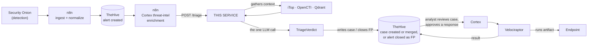
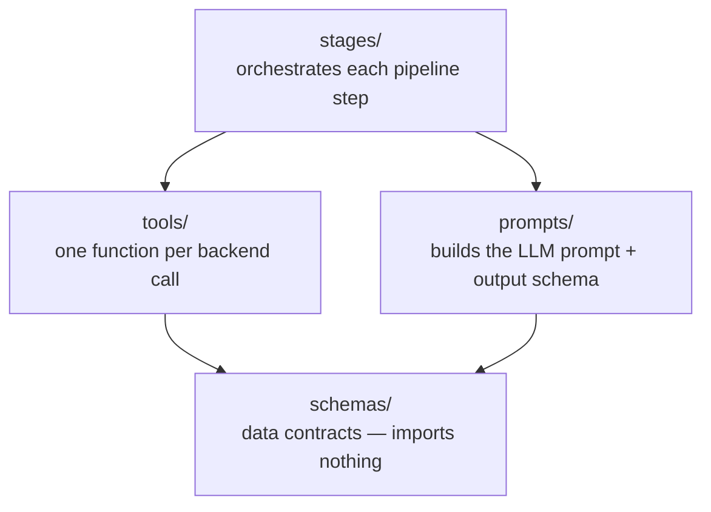
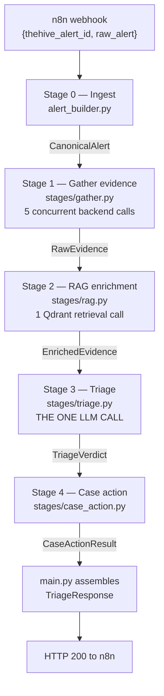
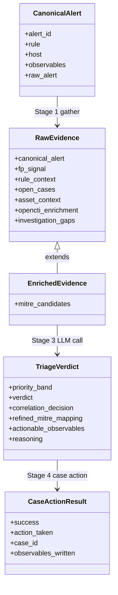
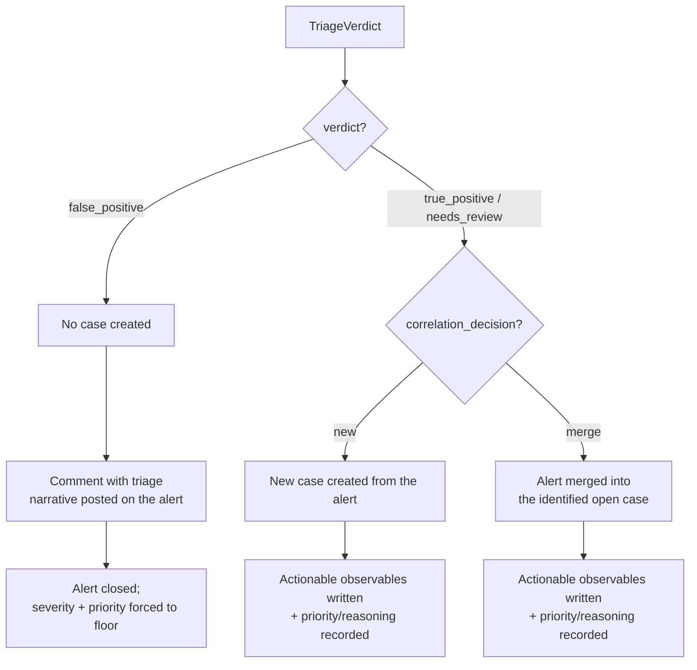
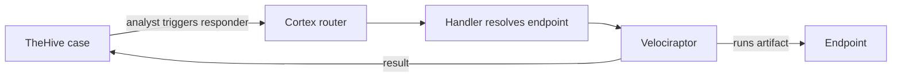

# SOC Automation Pipeline — AI-Assisted Triage Service

AI-assisted triage service for Security Onion alerts. Takes an already-enriched TheHive
alert, gathers additional context, runs one LLM call to produce a triage verdict, and
writes the outcome back to TheHive (new case / merge / closed false positive). Also
includes the automated endpoint-response mechanism a resulting case can trigger.

Part of the SOC-3s pipeline (SOC Automation internship, 3S / SUP'COM). Detection
(Security Onion), orchestration (n8n), and case management (TheHive, MISP, OpenCTI) are
separate platforms this service integrates with — **this repo is the triage + response
layer only.**

---

## Table of contents

- [1. Where this service fits](#1-where-this-service-fits)
- [2. What it is / isn't](#2-what-it-is--isnt)
- [3. Architecture](#3-architecture)
- [4. Triage pipeline](#4-triage-pipeline)
- [5. LLM call and model](#5-llm-call-and-model)
- [6. Response mechanism](#6-response-mechanism)
- [7. Repository layout](#7-repository-layout)
- [8. Error handling](#8-error-handling)

---

## 1. Where this service fits

| Upstream | This repo | Downstream |
|---|---|---|
| Security Onion detects → n8n normalizes, creates the alert in TheHive, runs Cortex threat-intel enrichment on its observables | n8n calls `POST /triage` once enrichment is done | Triage writes a case (or closes a false positive) in TheHive; an analyst can then trigger a response action, which flows through Cortex → Velociraptor to the endpoint |



---

## 2. What it is / isn't

| | |
|---|---|
| **Is** | A deterministic pipeline with exactly one LLM call per alert, no tool access for the model, a JSON-schema-constrained output, and a deterministic fallback if that call fails. |
| **Is not an agent** | No ReAct loop, no tool-calling LLM, no multi-turn reasoning. Evidence gathering is fixed and identical for every alert of a given shape — nothing for an LLM to decide there. |
| **Is not a scoring engine** | No numeric formula. The LLM assigns priority and verdict directly, reasoning over the evidence gathered for that specific alert. |
| **Is not read-only** | Writes directly to TheHive: creates cases, merges alerts, closes false positives, writes observables. |

---

## 3. Architecture

Four layers, each with exactly one job, dependencies flowing one way only:



| Layer | Job | Never does |
|---|---|---|
| `schemas/` | Defines every data shape (Pydantic models) passed between stages | Contains no logic and no I/O |
| `tools/` | One function per external call (TheHive, Elasticsearch, iTop, OpenCTI, Qdrant, local SQLite) | Never decides *when* to run — that's a stage's job |
| `prompts/` | System prompt text + the JSON schema the LLM's output must match | No I/O, no orchestration |
| `stages/` | Orchestrates one pipeline step: calls `tools/`, calls `prompts/` (for the LLM stage), produces the next typed object | Never talks to a backend directly — always goes through `tools/` |

Why it's split this way: every stage boundary is a Pydantic model, not a raw `dict`. A
field renamed in one place and misread in another fails loudly at validation time, not
silently three steps downstream.

---

## 4. Triage pipeline

`POST /triage` (`main.py::run_pipeline`) — one alert in, one response out, five steps:

| # | Stage | File | What happens | Output |
|---|---|---|---|---|
| 0 | Ingest | `alert_builder.py` | Raw Security Onion alert + fetched TheHive record → normalized | `CanonicalAlert` |
| 1 | Gather | `stages/gather.py` | 5 backend calls, concurrent (table below) | `RawEvidence` |
| 2 | RAG | `stages/rag.py` | 1 Qdrant retrieval call | `EnrichedEvidence` |
| 3 | Triage | `stages/triage.py` | **The one LLM call** | `TriageVerdict` |
| 4 | Case action | `stages/case_action.py` | Writes the outcome to TheHive | `CaseActionResult` |

Every stage: typed input → typed output, never a raw `dict`. Every stage: never raises —
a failure becomes a logged gap, a deterministic fallback, or `success=False`, never a
crash.

### Overview: the pipeline flow



### Overview: data objects through the pipeline

Each stage consumes one typed object and produces the next. `EnrichedEvidence` extends
`RawEvidence` rather than re-declaring its fields, so nothing gathered in Stage 1 can
silently go missing by the time Stage 3 reads it.



### Stage 0 — Ingest

- Entry point: FastAPI `POST /triage`, called by n8n with just `{thehive_alert_id, raw_alert}`.
- Service fetches the rest itself: the full TheHive alert record, including Cortex
  reports already attached to its observables by n8n's upstream enrichment.
- Raw alert + TheHive record → one `CanonicalAlert` object every later stage reads.

### Stage 1 — Gather evidence (`stages/gather.py`)

Five calls, concurrent, each independently time-bounded, each with a typed fallback on
failure:

| Source | Backend | Answers |
|---|---|---|
| FP signal | local SQLite | How often has this exact rule fired and closed as a false positive? |
| Detection rule context | Elasticsearch | What does the fired rule itself say — description, severity, known FP conditions? |
| Open cases | TheHive | Is there an open case this alert relates to (TheHive's native similar-cases engine)? |
| Asset criticality | iTop (CMDB) | How business-critical is the affected host? |
| Observable threat intel | OpenCTI | Is any observable already known — actor, malware family, campaign? |

- **Asset criticality only resolves for endpoint alerts.** Host identity is only
  extracted from endpoint-behavioral alerts; a network alert has IPs but no hostname, so
  it can't resolve to a CMDB asset.
- A failed/slow source never blocks the pipeline — it's recorded as a gap and the rest
  of the evidence still reaches the LLM.

### Stage 2 — RAG enrichment (`stages/rag.py`)

- One retrieval call: the rule's title + description → embedded → compared by semantic
  similarity against a pre-built Qdrant collection.
- Retrieves the closest-matching reference material by meaning, not exact keyword match.
- Runs unconditionally, every alert. This is the pipeline's only retrieval step.

### Stage 3 — The single LLM call (`stages/triage.py :: single_stage_triage`)

- One call. No tools. No second pass. Schema-constrained JSON output.
- Full evidence from Stages 1–2 → one structured prompt → one response containing:

| Output field | What it is |
|---|---|
| Priority | Assigned directly by the LLM (no scoring formula), reasoning over asset criticality, FP history, and threat-intel attribution |
| Verdict | `true_positive` / `false_positive` / `needs_review`, with a reasoning chain |
| Correlation decision | Merge into an open case, or open a new one — the model can only pick a case id that genuinely exists; an invented id is structurally impossible to emit |
| Refined technique mapping | Stage 2's retrieval candidates, validated: kept, dropped, or extended |
| Actionable observables | Extracted from the raw alert (process PID/path, file path), only if worth acting on and traceable to real evidence |

- On `false_positive`: writes a feedback record to the local FP tracker, keyed on the
  rule — future alerts from that rule carry this history as a calibration signal.
- On any failure (timeout, bad output, failed validation): falls back to a deterministic
  verdict instead of crashing.

### Stage 4 — Case action (`stages/case_action.py`)



| Branch | Trigger | What happens |
|---|---|---|
| False positive | `verdict == false_positive` | No case created. Triage narrative posted as a comment on the alert; alert closed, severity/priority forced to the floor. |
| New case | `correlation_decision == new` | Case created from the alert; actionable observables written onto it; priority + reasoning recorded. |
| Merge | `correlation_decision == merge` | Alert merged into the case the LLM identified; actionable observables written onto it; priority + reasoning recorded. |

---

## 5. LLM call and model

- The call itself: single-shot completion, zero tool access, schema-constrained
  response, deterministic fallback on failure. Model-agnostic by design.

**Model selection:**

| | Model | Why |
|---|---|---|
| Selected | Foundation-Sec-8B-Reasoning (Cisco, open-weight, 8B params) via Ollama | Cybersecurity-specific reasoning; self-hostable with no external API dependency, keeping triage fully inside the organization's own infrastructure |
| Actually used | Gemini 3.6 Flash, via API | Local inference on the hosting VM (no GPU) took up to 8 minutes/call — incompatible with real-time triage. Gemini returns clean, schema-valid output in under 30s; full pipeline runs in under a minute in most cases. |

The LLM endpoint is set via config (`LLM_BASE_URL` / `LLM_MODEL` / `LLM_API_KEY`) —
switching back to a locally-hosted model once adequate hardware is available is a
config change, not a code change.

---

## 6. Response mechanism

Once a case exists in TheHive, an analyst can trigger a response action from the case
interface — human-in-the-loop, nothing fires automatically. **Limited to alerts sourced
from endpoint monitoring.**



### Responders

| Responder | Action |
|---|---|
| `VR_KillProcess` | Terminate a malicious process by PID + executable path |
| `VR_BlockIP` | Add a host-level firewall block for a malicious IP |
| `VR_IsolateHost` | Network-isolate an endpoint, preserving its management channel |

One responder per action type, each tightly coupled to one custom Velociraptor
artifact — replacing Cortex's single generic responder, which has no parameter
validation and no safety controls. Every action is OS-aware; every artifact supports
dry-run.

### Observable types the analyst triggers on

| Type | Category | Used by |
|---|---|---|
| `process-path`, `process-pid` | Response (not IOC) | `VR_KillProcess` |
| `ip` | Threat-intel IOC | `VR_BlockIP` |
| `endpoint-ip`, `hostname` | Response (not IOC) | `VR_IsolateHost`, or endpoint resolution for the other two |

### Execution steps

1. **Cortex receives the job.** All three responders route through one shared
   dispatcher (`Reponse/Cortex-Responder/Velociraptor/`), because Cortex caches a
   responder's entry-point command at first registration and never re-reads it from
   disk — the dispatcher reads the job's data type and calls the correct handler.
2. **Resolve the target endpoint.** If the triggering observable isn't itself the
   endpoint identity (a PID or file path isn't), the handler looks up the case's other
   observables for an `endpoint-ip`/`hostname` entry. `VR_IsolateHost` skips this —
   it triggers directly on the endpoint identity.
3. **Locate the client in Velociraptor** by that endpoint's identity.
4. **Detect OS**, select the matching pre-built artifact (Linux/Windows differ for
   every action).
5. **Execute** the vetted artifact with the action's parameters.
6. **Write the result back** to the TheHive case.

### Custom Velociraptor artifacts

| Artifact | What it does |
|---|---|
| `Custom.Linux/Windows.Remediation.KillProcessExact` | Terminates a process, verifying PID *and* path first (prevents a false kill from PID reuse); Windows path comparison is case-insensitive |
| `Custom.Linux/Windows.Remediation.BlockIPExact` | Blocks an IP (iptables / Windows Firewall); preserves prior firewall state for rollback; self-checks Velociraptor connectivity survives the block, auto-rolls back if not |
| `Custom.Linux/Windows.Remediation.IsolateHost` | Isolates the endpoint from the network while explicitly keeping the Velociraptor management channel open; reversible on both platforms |

Full implementation detail: `Reponse/Cortex-Responder/readme.md`.

---

## 7. Repository layout

```
.
├── main.py                    FastAPI entrypoint: POST /triage, GET /health
├── config.py                  Loads + validates every env var at import time
├── alert_builder.py           Raw alert → typed CanonicalAlert
├── logging_config.py          Per-alert log context
│
├── stages/                    Pipeline steps — one file per stage
│   ├── gather.py                Stage 1 — parallel evidence gathering
│   ├── rag.py                   Stage 2 — RAG enrichment
│   ├── triage.py                Stage 3 — the single LLM call
│   ├── case_action.py           Stage 4 — writes the outcome to TheHive
│   └── _guard.py                Shared timeout/gap-handling helpers
│
├── tools/                     One function per external backend call
│   ├── thehive.py               TheHive reads and writes
│   ├── detection_rules.py       Elasticsearch rule lookup
│   ├── itop.py                  iTop CMDB asset lookup
│   ├── opencti.py               OpenCTI threat-graph enrichment
│   ├── qdrant.py                Stage 2 retrieval
│   ├── fp_tracking.py           Local SQLite false-positive history
│   └── es_client.py             Shared Elasticsearch transport
│
├── prompts/
│   └── triage_agent.py          System prompt + dynamic output schema builder
│
├── schemas/                   Pydantic data contracts
│   ├── alert.py                  CanonicalAlert + everything alert_builder produces
│   ├── evidence.py                RawEvidence / EnrichedEvidence
│   ├── assessment.py              Shared verdict building blocks
│   ├── verdict.py                 TriageVerdict — the LLM call's output contract
│   ├── case_action.py             CaseActionResult
│   └── result.py                  TriageResult / TriageResponse
│
├── Alert-normalization/       n8n-side alert ingestion script
│   └── n8n-scrpt.py
│
└── Reponse/                    Automated endpoint-response mechanism
    ├── Cortex-Responder/         Custom Cortex responders (own readme.md)
    │   ├── VR_BlockIP/
    │   ├── VR_IsolateHost/
    │   ├── Velociraptor/           Shared entry-point router
    │   └── Velociraptor_KillProcess/
    └── Custom-artifacts/         Custom Velociraptor VQL artifacts
        ├── Linux/
        └── Windows/
```

---

## 8. Error handling

| Rule | Means |
|---|---|
| A tool never raises | Every `tools/` function catches its own errors, returns a typed result + optional gap |
| A zero result is never ambiguous | "Checked, genuinely absent" and "could not check" are always distinguishable |
| Every stage degrades, never crashes | Gaps on partial failure, a deterministic fallback verdict if the LLM call fails, `success=False` instead of raising — every alert reaches an analyst, even under backend failure |
