# SOC-3s Pipeline v1 — Full Lifecycle Reference

This document describes the triage pipeline **as it exists in code today** (2026-08-23):
every stage that runs, the exact data that moves between them, and — in particular detail,
per request — Stage 3 and Stage 4's LLM input/output contracts, Stage 1's evidence
gathering, Stage 5's scoring formula, and the case-create/merge action. Every schema below
is the real Pydantic model in `schemas/`, not a simplification. `CLAUDE.md` is the
operating-rules document; `pipeline.md` is this repo's earlier (now partially stale)
capability snapshot; `score-review.md` is the deep-dive on Stage 5's scoring system alone;
this file is the current, complete walkthrough.

**What exists as running code**: Stage 0 (`alert_builder.py`), Stage 1, Stage 2, Stage 3,
Stage 4, Stage 5, Case Action (a deployment addition, not in the original architecture), and
— **new since the last revision of this document** — `main.py`, the FastAPI `/triage` HTTP
entrypoint that chains all of the above for a real incoming alert (§9). **What does not
exist yet**: Stage 6 (audit/FP-feedback wiring — the SQLite write function exists, nothing
calls it) and its `POST /feedback` endpoint.

**Test suite: 591 passing** (`python3 -m pytest tests/ -q`). One pre-existing flaky timing
test in `test_fp_tracking.py` (SQLite writes racing a 0.1s `STAGE_1_TOOL_TIMEOUT_FP`)
reproduces occasionally under load and passes clean on rerun — long-documented in
`CLAUDE.md`, not caused by any current change.

**Changes since the 2026-08-21 revision of this document** — all landed 2026-08-23, each
covered in full in §13:

| # | Change | Where |
|---|---|---|
| 1 | **`main.py` built** — `POST /triage` + `GET /health`, synchronous, HTTP 200 always | §9 |
| 2 | **Stage 4 now judges EVERY observable** (`actionable_observables`, each with a `confidence`) — and this list, not Stage 3's raw extraction, is what gets written to TheHive | §5, §7 |
| 3 | **Runbook retrieval, Stage 3 → Stage 4** — `retrieve_playbooks` finally has a caller | §5 |
| 4 | **`/triage`'s response now carries the complete evidence + reasoning trail**, not just Stage 4's curated summary | §8 |
| 5 | **`_capped_max_tokens`** — prompt-aware `max_tokens` capping in both LLM stages, after two live-caught context-window overflows | §4, §5 |
| 6 | **JSON-escaping false-discard bug fixed** in Stage 3's hallucination guard — every Windows path was being wrongly discarded | §4 |
| 7 | **Observable-write fixes** — real TheHive IDs captured, dedup, recovery from TheHive's own alert-import race, recommendation in the description | §7 |
| 8 | **LLM backend swapped twice for testing** (Ollama → vLLM/Colab → Gemini); per-stage `max_tokens` made configurable so the swap needs no code change | §12 |

```mermaid
flowchart TB
    N8N["n8n webhook POST<br/>{thehive_alert_id, raw_alert, asset_context}"] --> MAIN
    MAIN["main.py — POST /triage<br/>fetches hive_alert itself"] --> AB["alert_builder.py<br/>build_canonical_alert()"]
    AB -->|CanonicalAlert| S1

    subgraph S1["Stage 1 — gather_evidence()"]
        T["8 tools, asyncio.gather,<br/>timeout-bounded, never raise"]
    end
    S1 -->|RawEvidence| S2

    subgraph S2["Stage 2 — rag_enrichment()"]
        Q["3 Qdrant collections<br/>mitre / incidents / cve (gated)"]
    end
    S2 -->|EnrichedEvidence| S3

    subgraph S3["Stage 3 — context_analysis()<br/>LLM CALL #1"]
        L1["sees FULL EnrichedEvidence<br/>+ extracts observables"]
    end
    S3 -->|ContextualAssessment| S4

    subgraph S4["Stage 4 — analyst_verdict()<br/>LLM CALL #2"]
        PRE["pre-call fetches:<br/>TheHive case observables (merge only)<br/>+ Qdrant runbook_matches"]
        L2["sees a SANITIZED SUMMARY only<br/>judges EVERY observable"]
        PRE --> L2
    end
    S4 -->|"TriageVerdict<br/>(incl. actionable_observables)"| S5

    subgraph S5["Stage 5 — priority_scoring()"]
        F["Deterministic formula.<br/>ONLY place a number is computed."]
    end
    S5 -->|TriageResult minus case_action| CA

    subgraph CA["Case Action — case_action()"]
        W["Writes to TheHive:<br/>create OR merge, always"]
        WO["then writes Stage 4's actionable_observables:<br/>dedup, capture real IDs,<br/>tags disposition:* / confidence:*"]
        W --> WO
    end
    CA -->|CaseActionResult| OUT["TriageResponse<br/>HTTP 200, always"]

    style MAIN fill:#1a2a3a,stroke:#4a90d4
    style S3 fill:#2a1a3a,stroke:#9c6ade
    style S4 fill:#2a1a3a,stroke:#9c6ade
    style S5 fill:#1a3a1a,stroke:#4caf50
    style CA fill:#3a2a1a,stroke:#d4a54a
```



---

## 1. Stage 0 — `alert_builder.py::build_canonical_alert`

Not an LLM stage, not asyncio — pure, synchronous, presence-guarded parsing. Takes the raw
Security Onion webhook body (`raw_alert`), the alert+observables TheHive already holds
(`hive_alert`, fetched via `tools/thehive.py::get_full_alert_with_analysis` — **the sole
source of IOCs**, never re-derived from raw text), and optional `asset_context`. Produces
`CanonicalAlert` — every later stage's actual input.

**`CanonicalAlert`** (`schemas/alert.py`) — the fields every stage reads from, directly or
via `evidence.canonical_alert`:

| Field | Type | Notes |
|---|---|---|
| `alert_id` | `str` | The Security Onion / n8n-assigned id |
| `timestamp` | `datetime` | The alert's own detection time — authoritative for "how old is this evidence" (Stage 5) |
| `thehive_alert_id` | `str` | TheHive's alert id — the join key Case Action writes against |
| `rule` | `Rule` | `name`, `uuid`, `product`, `category`, `service` |
| `host` | `Host \| None` | `hostname`, `ip[]`, `mac[]`, `os`, `host_id`, `architecture` |
| `user` | `User \| None` | `name`, `id`, `domain`, `real_name`, `real_id` |
| `process` | `Process \| None` | name/executable/command_line/pid/parent/integrity_level/elevation_level/PE metadata (description/product/company/file_version)/code_signature/hashes/api |
| `network` | `Network \| None` | `src_ip`, `dst_ip`, `dst_ipv6`, `src_port`, `dst_port`, `protocol`, `initiated`, `community_id` |
| `file` | `File \| None` | name/path/size/hashes/code_signature/malware verdict/entropy/PE scan fields/timestamps |
| `library`, `target_process`, `related_entities`, `registry` | various | engine/event-shape-specific, presence-guarded |
| `observables` | `Observables` | `external_ips[]`, `domains[]`, `urls[]`, `hashes: HashBundle` — **from `hive_alert`, never regexed from raw text** |
| `cortex_results` | `list[CortexResult]` | pre-computed analyzer verdicts, attached before `/triage` is ever called |
| `event_dataset` | `str \| None` | e.g. `endpoint.events.process` — gates Stage 1's process-history call |
| `investigation_profile` | `Literal["network_threat","endpoint_behavior","malicious_file","generic"]` | set from the detection engine; used by Stage 1's ES correlation tool to pick Sigma-shaped vs. Suricata-shaped queries |

---

## 2. Stage 1 — `nodes/gather.py::gather_evidence`

**Purpose**: run every deterministic backend query the pipeline could possibly need, in
parallel, with hard per-tool timeouts, so Stage 3 never has to decide "should I look this
up" — the tool sequence is fixed and known in advance (this is architecture's whole reason
for not building an agentic tool-calling loop).

**Mechanism**: 8 tool coroutines, each already double-guarded (its own internal
`asyncio.wait_for` plus `nodes/_guard.py::_guarded`'s outer one), run inside one
`asyncio.gather(..., return_exceptions=True)`. Nothing should ever reach that gather as a
raw exception. A failed/slow/skipped tool produces a `Gap(source, tool, reason,
duration_ms)`, never an unhandled exception — `RawEvidence.investigation_gaps` is the
complete, honest record of what didn't come back.

| # | Tool | Backend | What it answers |
|---|---|---|---|
| 1 | `get_fp_signal` | local SQLite | How often has this rule/host produced a false positive historically? (counts, not a rate) |
| 2 | `detection_rule_lookup` | ES `so-detection` | The fired rule's own metadata — severity, status, MITRE tags, falsepositives |
| 3 | `search_open_cases_by_entities` | TheHive | Is there an open case sharing entities with this alert? → feeds Stage 3's merge/new call |
| 4 | `search_closed_cases_by_rule` | TheHive | How was this rule/these entities resolved historically? (TP/FP counts) |
| 5 | `itop_asset_lookup` | iTop CMDB | Asset criticality, OS, location |
| 6 | `elasticsearch_related_alerts` | ES (Sigma or Suricata index, branched on `investigation_profile`) | What other alerts fired near this one? |
| 7 | `elasticsearch_process_history` | ES process index | What else ran on this host? (gated — only fires for `event_dataset=="endpoint.events.process"`) |
| 8 | `opencti_observable_enrichment` | OpenCTI GraphQL | Is any IOC a known indicator in OpenCTI's threat graph? |

**Output — `RawEvidence`** (`schemas/evidence.py`):

| Field | Type | Populated by |
|---|---|---|
| `canonical_alert` | `CanonicalAlert` | pass-through |
| `fp_signal` | `FPSignal \| None` | tool 1 — `rule_fp_count_24h/30d`, `host_fp_count_24h/30d` |
| `rule_context` | `RuleContext \| None` | tool 2 — `found`, `title`, `severity`, `level`, `status`, `mitre_attack[]`, `mitre_tactics[]`, `falsepositives[]`, `has_known_falsepositives`, `source_engine`, ... |
| `open_cases` | `list[ShallowCase]` | tool 3 — `case_id`, `severity`, `stage`, `status`, `tags[]`, `similar_observable_count` |
| `closed_cases_summary` | `ClosedCasesSummary` | tool 4 — `tp_count`, `fp_count`, `other_count`, `avg_severity`, `matched_by[]` |
| `asset_context` | `AssetContext \| None` | tool 5 — `found`, `hostname`, `criticality`, `os_family`, `location`, ... |
| `related_alerts_24h` | `list[AlertSummary]` | tool 6 — `timestamp`, `rule_name`, `rule_uuid`, `severity`, `host`, `user`, `alert_id` |
| `process_history_24h` | `list[ProcessEvent]` | tool 7 — `name`, `command_line`, `parent_name`, `integrity_level`, ... |
| `opencti_enrichment` | `list[OpenCTIEnrichment]` | tool 8 — `found`, `entity_type`, `indicator_names[]`, `relations[]` |
| `investigation_gaps` | `list[Gap]` | any tool that failed, was skipped, or found nothing to query on |
| `stage_1_duration_ms` | `int` | wall time |

**The `{found: false}` invariant**, enforced everywhere in this stage: a missing field is
never a bare `None` with no explanation — it's a real, populated zero-value model
(`FPSignal()`, `RuleContext(found=False)`) *plus* a `Gap` saying why. "Checked, nothing
there" and "couldn't check" must never look the same.

---

## 3. Stage 2 — `nodes/rag.py::rag_enrichment`

**Purpose**: retrieve semantically-relevant context Stage 1's exact-match tools can't
surface — similar MITRE techniques, similar past incidents, relevant CVEs.

**Mechanism**: 3 Qdrant collection queries, same double-guard + single-gather pattern as
Stage 1, via `nodes/_guard.py`.

| Collection | Tool | Query built from | Gate |
|---|---|---|---|
| `mitre_techniques` | `retrieve_mitre` | rule title + description + one priority-selected behavioral phrase (`_most_specific_behavior_keyword` — never a concatenation of everything, which collapses recall) | always fires |
| `incident_history` | `retrieve_incidents` | same query as MITRE (same "what actually happened" content) | always fires |
| `cve_context` | `retrieve_cve` | product hint (from a non-Microsoft code-signature subject, or filename as last resort) + rule title + first MITRE technique | only fires when `_has_cve_indicators` finds a product signal — most alerts get `[]`, not a wasted query |

**`retrieve_playbooks` exists in `tools/qdrant.py` but is never called here** — its natural
query input is Stage 3's *refined* MITRE mapping, which doesn't exist yet at Stage 2.
Genuinely unbuilt, not a bug.

**Output — `EnrichedEvidence`** (`schemas/evidence.py`) — subclasses `RawEvidence` (a field
added to Stage 1 can never silently go missing from Stage 2), adds:

| Field | Type |
|---|---|
| `mitre_candidates` | `list[MitreCandidate]` — `technique_id`, `technique_name`, `tactic[]`, `platforms[]`, `score` |
| `cve_matches` | `list[CveMatch]` — `cve_id`, `cvss_score`, `severity`, `affected_products[]`, `score` |
| `incident_matches` | `list[IncidentMatch]` — `incident_id`, `title`, `severity`, `status`, `attack_type`, `summary`, `score` |
| `stage_2_duration_ms` | `int` |

`EnrichedEvidence` is what Stage 3 receives in full.

---

## 4. Stage 3 — `nodes/context.py::context_analysis` — LLM CALL #1

**Purpose**: interpret the full evidence package — refine the MITRE mapping, decide
new-case-vs-merge, surface contextual signals the deterministic formula can't see, extract
any IOC the automated pipeline missed, assign a holistic criticality score. **Single-shot,
no tools, no loop.**

### Exact input

`prompts.context_agent.build_user_prompt(evidence)` is literally
**`evidence.model_dump_json(indent=2)`** — the model sees the *entire* `EnrichedEvidence`
object, unredacted. This is deliberate and is the one place in the pipeline that sees
everything Stage 1+2 produced (Stage 4 does **not** get this — see §5).

### System prompt (verbatim, `prompts/context_agent.py::SYSTEM_PROMPT`)

```
You are a Tier-2 SOC analyst reviewing an alert investigation package.
You have complete evidence — you do NOT need to call any tools.
Your outputs must be strictly valid JSON matching the provided schema.

Your job has five parts:
1. Refine the MITRE mapping — validate against evidence, add/remove techniques
2. Judge correlation — does this alert merge with existing cases, and is it a kill-chain progression?
3. Identify contextual signals — factors the deterministic scoring formula cannot see
4. Extract critical observables the automated pipeline missed
5. Assign a criticality score

Two different kinds of prior-case data are in the evidence, and they mean different things:
- open_cases: currently open TheHive cases. These are the ONLY valid merge targets for
  correlation_decision.merge_into_case_id.
- incident_matches: past incidents retrieved by semantic similarity search. These are
  reference context for your reasoning — never a case to merge into, and never something
  to cite as a currently open case.

cortex_results[].verdict is pre-filtered to ONLY "malicious"/"suspicious" — "info"/"safe"
never appear there. EMPTY verdict means no adverse finding, not "clean" and not "no data".
taxonomies[] carries every row verbatim including info/safe — ignore those as noise. Base
extraction and criticality on entries whose verdict is non-empty.

TASK 4 — EXTRACT CRITICAL OBSERVABLES:
Extract observables that are: (1) NOT already in canonical_alert.observables (n8n already
captured those — redundant, not extraction), (2) derived from suspicious behavior
(process ancestry, command-line, file drop location) OR a cortex_results entry with
non-empty verdict, (3) specific and actionable, not a vague description.

EVERY value MUST be copied character-for-character from the evidence JSON above. Never
invent, paraphrase, or reconstruct a plausible-looking hash/IP/command line — if you can't
point to the exact substring it came from, don't report it. An unsupported value is worse
than none: it will be discarded as a hallucination.

Each bucket accepts exactly ONE observable_type: process->"process-path", file->"file",
external_ips->"ip", domains->"domain", urls->"url", hash->"hash". Put each observable in
the bucket matching what it actually is — a URL goes in "urls" not "domains", a hash in
"hash" not "file". The process bucket is specifically the executable's PATH (e.g.
"C:\Windows\Temp\xordump.exe"), the thing an analyst would actually block or quarantine —
not a process name, PID, or command-line fragment.

For each: observable_type, value, rationale, confidence, source ("behavioral_analysis",
"cortex_result", or "command_line_parsing").

Do NOT extract: legitimate system processes absent suspicious context; anything with an
EMPTY cortex verdict; anything already in canonical_alert.observables; anything you can't
quote verbatim. Empty lists are a valid, expected answer on benign alerts.

TASK 5 — CRITICALITY SCORE (0-100):
A single holistic judgment of how critical this alert is right now — not decomposed like
likelihood/impact, not the same as "confidence". Augments the deterministic score
downstream; does not replace it. Bands (a calibration guide, not a formula): 0-20 almost
certainly benign/FP; 21-40 likely benign, unconfirmed; 41-60 genuinely ambiguous; 61-80
likely malicious (Cortex "malicious" or aggressive MITRE + behavioral indicators); 81-100
highly critical (Cortex "malicious" + multi-stage behavior or kill-chain progression).

Weigh: Cortex verdicts when analyzers actually ran (non-empty cortex_results with all-empty
verdicts is real "checked, found nothing" evidence, pulls the score down; an EMPTY
cortex_results list is just "no data" — neutral, never evidence of benignness), MITRE
tactics, multi-stage chains, kill-chain progression, closed-case history (past TP raises,
past FP lowers).

BEFORE finalizing, check this score against your own correlation_decision and
contextual_modifiers: an "increase"/"strong" or "increase"/"critical" modifier, a cited
closed TruePositive case, or detected kill-chain progression must not coexist with a 0-20
"almost certainly benign" score — one of the two is wrong. Reconcile them before you answer.
```

### The call

`POST {LLM_BASE_URL}/chat/completions`, model `config.LLM_MODEL`, `temperature=0.1`,
`response_format: {"type":"json_schema", "json_schema": {"name":"ContextualAssessment",
"schema": <hand-inlined schema>}}`, `timeout=STAGE_3_LLM_TIMEOUT` (600s in this deployment).
The model is whatever `.env` points at — see §12 for this deployment's backend history and
the measured latency of each.

**`max_tokens` is computed per call, not fixed** (2026-08-23):

```python
max_tokens = _capped_max_tokens(SYSTEM_PROMPT, user_prompt, config.STAGE_3_DESIRED_MAX_TOKENS)
```

`_capped_max_tokens` estimates the built prompt's token count from its character count and
caps the requested completion so `prompt + completion + safety_margin` stays under the
model's real context window, flooring at `LLM_MIN_COMPLETION_TOKENS` rather than going
negative on a pathological prompt:

| Constant | Default | Meaning |
|---|---|---|
| `STAGE_3_DESIRED_MAX_TOKENS` | 4000 | what Stage 3 asks for before capping (`.env`-overridable — 8000 in this deployment) |
| `LLM_MAX_CONTEXT_TOKENS` | 8192 | the model's real window (`.env`: 1048576 on Gemini) |
| `LLM_TOKEN_ESTIMATE_CHARS_PER_TOKEN` | 3.2 | no local tokenizer exists for these models; deliberately low, since underestimating chars-per-token *over*estimates tokens — the safe direction |
| `LLM_CONTEXT_SAFETY_MARGIN_TOKENS` | 400 | headroom on top of the estimate |
| `LLM_MIN_COMPLETION_TOKENS` | 500 | floor |

This exists because of **two separate live-caught 400s**, not as speculative defense. First:
an evidence-rich alert (5 MITRE candidates + 2 incident matches) produced a 4193-token
prompt; `4193 + 4000 = 8193`, one token over the window, and the backend rejected the request
outright — Stage 3 fell back gracefully, silently losing its LLM refinement entirely on
exactly the alerts that most needed it. Second, after the n8n envelope bug (§13.5) was fixed
and `canonical_alert` started carrying its *real* content, a 19,592-character prompt measured
at **5,799 real tokens** — a 3.38 chars/token ratio, denser than the 3.5 the first fix had
assumed, so `5799 + 2394 = 8193` overflowed again by one token. The 3.5 → **3.2** and
200 → **400** retune came from those two real measurements.

**Why the schema is hand-inlined, not `ContextualAssessment.model_json_schema()`**: Pydantic
emits `$defs`/`$ref` for nested models. Live-tested: a `$ref`-based schema made Ollama's
grammar compiler hang (280+ seconds, no return). The identical schema hand-flattened
completed in 68.9s. `prompts/context_agent.py::_BASE_SCHEMA` is therefore maintained by
hand; `tests/test_context.py::TestSchemaStaysInSync` guards it from drifting off
`ContextualAssessment`'s real fields.

**The schema is built per-call**, not a static constant —
`build_contextual_assessment_schema(evidence)` constrains
`correlation_decision.merge_into_case_id`'s enum to *this alert's actual* `open_cases` ids
(plus `null`), and drops `"merge"` from `action`'s enum entirely when there are no open
cases. This closes a real observed bug: the model once set `merge_into_case_id` to an id
that only existed in `incident_matches` (a similar *past* incident, not a real open case).
Making the wrong answer structurally unrepresentable fixed it; a free-text field didn't.

### Output — `ContextualAssessment` (`schemas/assessment.py`)

| Field | Type | Notes |
|---|---|---|
| `refined_mitre_mapping` | `list[MitreMapping]` | each: `technique_id`, `technique_name`, `tactic`, `confidence` (high/medium/low), `basis` |
| `correlation_decision` | `CorrelationDecision` | `action` (`"new"\|"merge"`), `merge_into_case_id`, `kill_chain_progression_detected`, `reasoning` |
| `contextual_modifiers` | `list[ContextualModifier]` | each: `dimension` (`"likelihood"\|"impact"`), `factor_name`, `direction` (`"increase"\|"decrease"`), `strength` (`"weak"\|"medium"\|"strong"\|"critical"`), `reasoning` — **never a number** |
| `additional_investigation_gaps` | `list[str]` | free text, the LLM's own noticed gaps |
| `confidence` | `"high"\|"medium"\|"low"` | |
| `extracted_observables` | `ExtractedObservables` | 6 typed buckets (`process`, `file`, `external_ips`, `domains`, `urls`, `hash`), each `list[ExtractedObservable]` (`observable_type`, `value`, `rationale`, `confidence`, `source`). Was a dead output until 2026-08-21, then written directly to TheHive; since 2026-08-23 it is **no longer written directly** — it is fed to Stage 4 (§5 TASK 5), whose judged `actionable_observables` is what Case Action writes (§7). Still surfaced whole in the `/triage` response (§8) |
| `llm_criticality_score` | `int` (0–100) | the one number this stage produces — feeds Stage 5 as an augmenting 4th component, never a replacement |
| `stage_3_duration_ms` | `int` | set by the node after the call returns |

### Defense-in-depth after parsing

- `_validate_merge_target` — nulls out a `merge_into_case_id` that somehow isn't in
  `evidence.open_cases` even after the schema constraint, appending a gap note. Belt and
  suspenders behind the enum fix.
- `_validate_extracted_observables` — discards any extracted value not found verbatim in
  `evidence.model_dump_json()` (hallucination guard) and any value that duplicates an
  existing `canonical_alert.observables` entry (redundancy guard).

  **Fixed 2026-08-23 — the escaping false-discard bug.** The hallucination check was
  `if item.value not in evidence_json`, comparing an **unescaped** needle against a
  **JSON-escaped** haystack. `item.value` has already been JSON-*decoded* out of the LLM's
  response, so a real Windows path carries one backslash per separator; `evidence_json` is
  JSON *text*, where Pydantic's serializer has escaped every `\` as `\\` and every `"` as
  `\"`, as the JSON spec requires. The consequence: **any genuinely-correct value containing
  a backslash or a quote always failed the check** — i.e. every Windows path, which is
  precisely what the `process`/`file` buckets exist to carry. Live-caught on a real run where
  the alert's own real `-OutFile` path (`C:\Windows\Temp\xordump.exe`) was discarded as a
  hallucination alongside 5 values that genuinely were fabricated. Fix — escape the needle
  the same way before comparing:

  ```python
  needle = json.dumps(item.value, ensure_ascii=False)[1:-1]
  if needle not in evidence_json: ...   # discard
  ```

  `ensure_ascii=False` is load-bearing, not stylistic: the default `True` would
  `\uXXXX`-escape any non-ASCII value and reproduce the identical false-discard for e.g. an
  IDN domain. The duplicate-check on the next line was left untouched — both its sides are
  plain Python strings, never affected. A scoping check confirmed this was the only place in
  the repo doing a substring test of a plain string against JSON-serialized Pydantic output.

### Fallback (any failure — connection error, timeout, malformed JSON, failed validation)

`_stage_3_fallback(evidence)` — deterministic, never raises: preserves `mitre_attack` from
Stage 1's `rule_context` (does **not** return an empty list — the v3 "silent severity cap"
bug this explicitly guards against), sets `action="merge"` iff `open_cases` is non-empty
(using the first real open case), `contextual_modifiers=[]`, `confidence="low"`,
`llm_criticality_score=50` (neutral — a downed LLM must never fabricate a criticality
judgment), and `extracted_observables` left empty — a downed LLM must never fabricate an IOC
either.

---

## 5. Stage 4 — `nodes/analyze.py::analyst_verdict` — LLM CALL #2

**Purpose**: the actual triage call — likelihood, impact, verdict, what should happen next,
and (added 2026-08-23) a per-observable disposition judgment. The second and **last** LLM
call this pipeline is allowed (CLAUDE.md hard constraint: exactly 2, total).

### Two real backend fetches happen BEFORE the call (added 2026-08-23)

Neither is wrapped in `nodes/_guard.py`'s `_guarded`, for the same reason the LLM call
itself isn't: both functions already self-time-out and are contractually never-raise.

1. **The merge target's existing observables** — only when
   `context.correlation_decision.action == "merge"` **and** `merge_into_case_id` is real
   (Stage 3 resolves it; `case_action.py` only ever consumes it). Calls
   `tools/thehive.py::fetch_case_observables_with_type(case_id)` — the same live-proven
   `getCase -> observables -> page` query `_fetch_case_observables` already used, but keeping
   `_id`/`dataType`/`tags` instead of collapsing rows to bare value strings. Timeout:
   `config.STAGE_4_TOOL_TIMEOUT_THEHIVE` (5.0s). On `action == "new"` or any failure:
   `case_observables = []` and the stage proceeds. `TriageVerdict` has no gap-list field, so
   this is log-only — the same limitation `_validate_recommended_action` already works within.
2. **Runbook matches** — `tools/qdrant.py::retrieve_playbooks` against the real
   `soc_playbooks` collection, queried by `_build_playbook_query(context, evidence)` (the
   rule title plus each refined technique's id/name/tactic, mirroring
   `nodes/rag.py::_build_mitre_query`'s construction style). Timeout:
   `config.STAGE_4_TOOL_TIMEOUT_QDRANT`.

   `retrieve_playbooks` was built and live-verified back on 2026-08-16 and then **called by
   nobody for a week** — `nodes/rag.py`'s own docstring explains why: its natural query input
   is Stage 3's *refined* MITRE mapping, which doesn't exist yet at Stage 2. Stage 4 is the
   first point in the pipeline where it does.

   Results land on `TriageVerdict.runbook_matches` **post-hoc**, the same way
   `stage_4_duration_ms` is set — so they are attached **whether or not the LLM call
   succeeded**, including on the deterministic fallback path.

### Exact input — the "prompt injection firewall"

Unlike Stage 3, Stage 4 does **not** see raw `EnrichedEvidence`.
`prompts.analyst_agent._summarize_evidence(context, evidence)` builds a sanitized `dict`:

```python
{
    # --- the three observable provenances (added 2026-08-23) ---
    "known_observables":     canonical_alert.observables.model_dump(),   # n8n's extraction
    "extracted_observables": context.extracted_observables.model_dump(), # Stage 3's
    "case_observables":      case_observables,                           # merge target's, live from TheHive
    "runbook_matches": [                                                 # Qdrant, document_text truncated
        {"title": m.title, "category": m.category, "section": m.section,
         "document_text": m.document_text[:1500]}
        for m in runbook_matches
    ],
    # --- the original firewalled summary ---
    "rule_context": evidence.rule_context.model_dump() if ... else None,
    "asset_context": evidence.asset_context.model_dump() if ... else None,
    "threat_intel": [
        {"observable": r.observable, "type": r.type, "verdict": r.verdict,
         "details_truncated_300": r.details[:300], "analyzer": r.analyzer}
        for r in evidence.canonical_alert.cortex_results
    ],
    "temporal_context": {
        "total_related_alerts": len(evidence.related_alerts_24h),   # COUNT, not the list
        "host": ..., "user": ...,
    },
    "historical_context": {                                          # COUNTS only
        "tp_count": ..., "fp_count": ..., "avg_severity": ...,
    },
    "mitre_mapping": [m.model_dump() for m in context.refined_mitre_mapping],
    "investigation_gaps": context.additional_investigation_gaps,
    "contextual_modifiers": [m.model_dump() for m in context.contextual_modifiers],
}
```

**Explicitly never included**: raw log lines, full command lines, Cortex report bodies
beyond 300 characters, `related_entities`, anything off the raw alert not named above.
`Cortex.details` gets truncated in the summary itself — Stage 4 never sees a full VirusTotal
report; `runbook_matches[].document_text` is truncated at 1500 characters for the same reason.

**The firewall boundary moved, deliberately and narrowly, on 2026-08-23.**
`canonical_alert.observables` used to be excluded outright; it and Stage 3's
`extracted_observables` are now included, because TASK 5 (below) cannot judge a list it can't
see. What is *not* included is everything those values came *from* — the raw alert, the log
lines, the command lines. Stage 4 sees the observable **values**, never their untrusted
surrounding text. `_summarize_evidence` returns a plain `dict`, not a schema model: it never
crosses a stage boundary (Stage 4's real typed contract is
`(ContextualAssessment, EnrichedEvidence) -> TriageVerdict`), matching Stage 3's
`build_user_prompt` precedent of not inventing a model for a pure rendering detail.

### System prompt (verbatim, `prompts/analyst_agent.py::SYSTEM_PROMPT`)

```
You are a Tier-2 SOC analyst making the final triage call on an alert.
You have a curated evidence summary, already investigated by a Tier-2 analyst colleague
(Stage 3) who refined the MITRE mapping, judged correlation with existing cases, and flagged
contextual signals. You do NOT need to call any tools. Your outputs must be strictly valid
JSON matching the provided schema.

Your job has five parts:
1. Judge likelihood — how likely is this a real, malicious event (not a numeric score —
   one of the four labels in the schema).
2. Judge impact — if this IS real, how bad would it be.
3. Render a verdict — true_positive, false_positive, or needs_review, when the evidence
   genuinely doesn't support a confident call either way.
4. Recommend an action — what should happen to this alert next. runbook_matches, when
   present, are retrieved SOC runbook sections for this alert's MITRE techniques —
   reference procedural guidance on how this TYPE of alert is normally handled, not
   evidence about this specific alert. Let them inform your recommended_action and
   reasoning when relevant (e.g. a runbook's documented response for this technique),
   but never cite a runbook as proof the alert itself is malicious — that's what
   threat_intel and the behavioral evidence are for.
5. Decide which observables need action — see TASK 5 below.

correlation_decision (from your colleague's prior analysis) tells you whether this alert
should merge into an existing case or become a new one. The schema's recommended_action enum
is already constrained to match that decision — you do not need to re-derive it, only choose
among the options actually offered. merge_quiet is for routine correlation with no new
severity signal; merge_and_retier is for a merge where this alert itself indicates the
existing case just got more serious (kill_chain_progression_detected, or a notably more
severe rule than the case's history suggests).

threat_intel entries carry a `verdict` list — non-empty means an analyzer flagged something
adverse (malicious/suspicious); an EMPTY list means "checked, nothing adverse reported", not
"no data" and not "clean" in a positive sense — treat these differently. An alert with no
threat_intel entries at all means no observable had any analyzer report — genuinely no data,
weigh it as neutral, not as evidence of either verdict.

contextual_modifiers were produced by your colleague, each already labeled with a direction
(increase/decrease) and strength (weak/medium/strong/critical) for either likelihood or
impact — weigh them, don't ignore them, but they are inputs to your judgment, not a
pre-computed answer.

evidence_citations must each be a short, specific pointer to a field in the evidence summary
above (e.g. "rule_context.severity=high", "threat_intel[0].verdict=malicious") — never a
paraphrase, never something not traceable to a field actually present in the summary you were
given.

TASK 5 — ASSESS EVERY OBSERVABLE:
known_observables (n8n's own extraction), extracted_observables (your Stage 3 colleague's
extraction), and — only present on a merge — case_observables (already recorded on the case
you're merging into) are three different provenances of the SAME kind of thing: observables
already surfaced somewhere in this investigation. Your job here is NOT to extract anything
new, and NOT to pick a shortlist — assess EVERY observable across all three lists and return
one entry for each. There is no "not worth mentioning": even an observable you judge
completely benign given your verdict and reasoning still gets an entry, with
recommended_disposition="monitor" and confidence="low" — omitting it is wrong, only your
confidence in it changes. Duplicates across lists (the same value appearing in more than one
of known_observables/extracted_observables/case_observables) get exactly one entry, not one
per list. Every value you return MUST be copied character-for-character from one of those
three lists — never invent, paraphrase, or reconstruct a plausible-looking value.

For each observable: observable_type, value, recommended_disposition (block = clearly
malicious, ready to action; quarantine = suspicious file/process, contain but don't
blanket-block; monitor = benign-leaning or genuinely uncertain, not yet actionable),
confidence (high/medium/low — how sure you are about THIS specific disposition, independent
of your overall alert verdict), and reasoning. An empty list is only correct when all three
source lists were themselves empty — never as a way to avoid assessing something uncertain.
```

**TASK 5 replaced a narrower first version, the same day it shipped.** The original build
asked Stage 4 for a filtered "worth acting on" shortlist. That was corrected — user-directed
— to *every* observable, each annotated with a `confidence`, because `case_action.py` (§7)
now writes **this list and only this list** to TheHive. A filtered list means anything the
model felt uncertain about is silently dropped from the case entirely; an annotated complete
list means a weak signal still lands, tagged as weak.

### The call

Same shape as Stage 3: `POST {LLM_ANALYZE_BASE_URL}/chat/completions`,
`config.LLM_ANALYZE_MODEL` (this deployment runs the same model for both stages — architecture
§19's `qwen3.5:4b` was never pulled), `temperature=0.1`, hand-inlined `json_schema`,
`timeout=STAGE_4_LLM_TIMEOUT` (600s).

`max_tokens` is capped by the same `_capped_max_tokens(...)` helper Stage 3 uses (see §4 for
the constants and the two live-caught overflows), against
`config.STAGE_4_DESIRED_MAX_TOKENS` — default **2000**, `.env`-overridden to **16000** in
this deployment. The helper is duplicated in both node files rather than shared, matching
`_extract_first_json_object`'s existing precedent: two parallel, deliberately independent
stage files, and a short helper isn't worth a cross-node dependency.

**Why Stage 4's desired value needed raising twice, both live-caught, neither assumed.**
Stage 4's prompt used to be far smaller than Stage 3's (~3.4KB, a real call measured at
81.2s). It isn't any more — TASK 5 makes the *output* scale with observable count, and a real
merge target carrying 21 case observables needs one judged entry each. On a real `/triage`
call the response hit `finish_reason="length"` at 2000, then again at 8000: the raw HTTP
capture showed `completion_tokens=1004` against `total_tokens=9202` on a 5221-token prompt,
meaning **~2977 tokens went to invisible thinking alone** on a reasoning-enabled model, on
top of a much larger visible JSON body. Raised to 16000 and re-verified clean:
`finish_reason="stop"`, `completion_tokens=866`, 10 real judged observables. A diagnostic
script capturing the raw HTTP response was used to confirm the cause *before* changing the
number — `nodes/analyze.py`'s own defensive parse would otherwise have swallowed the failure
into a silent fallback.

**Dynamic schema constraint**: `build_triage_verdict_schema(context, evidence)` restricts
`recommended_action`'s enum based on `context.correlation_decision.action`
(`Literal["new","merge"]`, exhaustive) — `merge` excludes `create_case`; `new` excludes
`merge_quiet`/`merge_and_retier`. Same mechanism as Stage 3's merge-target fix: makes a
self-contradictory recommendation structurally unrepresentable.

### Output — `TriageVerdict` (`schemas/verdict.py`)

| Field | Type | Notes |
|---|---|---|
| `likelihood` | `"unlikely"\|"possible"\|"likely"\|"near_certain"` | label, never a number |
| `impact_if_true` | `"minor"\|"moderate"\|"significant"\|"severe"` | 4-tier, ascending |
| `verdict` | `"true_positive"\|"false_positive"\|"needs_review"` | |
| `reasoning` | `str` | analytical justification |
| `summary` | `str` | short, human-facing |
| `recommended_action` | `"create_case"\|"close_fp"\|"merge_quiet"\|"merge_and_retier"\|"needs_review"` | dynamically constrained per call — see above |
| `evidence_citations` | `list[str]` | pointers into the summary the LLM was given |
| `actionable_observables` | `list[ActionableObservable]` | **added 2026-08-23** — one entry per observable across all three source lists (§5's TASK 5). Each: `observable_type`, `value`, `recommended_disposition` (`"block"\|"quarantine"\|"monitor"`), `confidence` (`"high"\|"medium"\|"low"`, LLM-set, required), `reasoning`, and `observable_id: str \| None` — **never LLM-set** (absent from the schema sent to the model), filled in post-hoc by Case Action once the real TheHive write or ID lookup resolves |
| `runbook_matches` | `list[PlaybookMatch]` | **added 2026-08-23** — set post-hoc by the node, never by the LLM. Carried on `TriageVerdict` rather than added as a new `priority_scoring` parameter, since this is the object that already flows Stage 4 → Stage 5 |
| `stage_4_duration_ms` | `int` | set post-hoc by the node |

### Defense-in-depth

`_validate_recommended_action` — if the returned `recommended_action` is incompatible with
`correlation_decision.action` even after the schema constraint, logs and falls back to
`"needs_review"`. No gap-list field exists on `TriageVerdict` to append a note to (unlike
Stage 3) — log-only, a documented minor deviation from the Stage 3 pattern.

`_validate_actionable_observables` (**added 2026-08-23**) — every returned
`actionable_observables[].value` must be traceable to
`known_observables ∪ extracted_observables ∪ case_observables`, the exact three lists TASK 5
names. Not the full evidence, which Stage 4 never sees — that firewall boundary is unchanged.

This validator **shipped with the escaping fix already applied**, rather than rediscovering
it: the haystack is built with `ensure_ascii=False` and each needle escaped as
`json.dumps(value, ensure_ascii=False)[1:-1]`, exactly as §4's fix does — because the
identical bug class (a plain-string needle against JSON-escaped text) would otherwise
silently discard every judged Windows path. Mutation-tested the same way: reverting the
escaping flips exactly the one backslash-bearing test red, the three plain-string tests stay
green.

### Fallback (architecture's own worked example, verbatim)

```python
TriageVerdict(
    likelihood="possible", impact_if_true="moderate", verdict="needs_review",
    reasoning="Stage 4 LLM unavailable, defaulting to human review",
    summary="Automated triage failed, analyst review required",
    recommended_action="needs_review", evidence_citations=[],
    actionable_observables=[],
)
```

`runbook_matches` is attached to this fallback object too — it's set post-hoc by the node,
outside the try/except, so a downed LLM still returns whatever runbooks Qdrant found.
`actionable_observables` stays empty: a downed LLM must never fabricate a disposition
judgment, the same principle as Stage 3's empty `extracted_observables`.

---

## 6. Stage 5 — `scoring.py` + `nodes/score.py::priority_scoring`

**Purpose**: turn Stage 3/4's judgment into one auditable 0–100 number and a P1–P5 priority
band. **The only place in the entire pipeline a number is computed** — Stage 3/4 output only
labels and modifiers by hard constraint. Pure Python, no I/O, `<200ms`.

> **`score-review.md` is the full deep-dive on this stage** — every term's value table, the
> three architecture §10 terms that had to be redesigned because the data didn't exist, why
> low confidence *escalates* priority, and a term-by-term trace of a real live run. What
> follows here is the summary. Stage 5's own code is unchanged since 2026-08-21; only
> `TriageResult`'s field set around it grew (§8).

### The formula, term by term

**`base_likelihood`** (each term, then clamped 0–100):

| Term | Range | Source |
|---|---|---|
| `rule_severity_score` | 0–90 | `RuleContext.level` → `{critical:90, high:70, medium:45, low:25, informational:10}`, default 45 |
| `threat_intel_adjustment` | −40 to +30 | any `cortex_results[].verdict` contains "malicious" → +30; "suspicious" → +15; all present but empty verdicts → −40 ("checked, clean"); no `cortex_results` at all → 0 ("no data") |
| `fp_rate_penalty` | −40 to 0 | `−40 × max(min(1, rule_fp_count_30d/10), min(1, host_fp_count_30d/10))` — a saturating proxy, since `FPSignal` reports counts, not a rate |
| `rule_status_penalty` | −30 to 0 | `RuleContext.status` → `{stable:0, test:-10, experimental:-20, deprecated:-30}`, absent status → 0 (not a penalty) |
| `historical_pattern_adjustment` | −25 to +15 | linear interpolation on `tp_count/(tp_count+fp_count)`; requires ≥3 closed cases, else 0 |

**`base_impact`** (clamped 0–100):

| Term | Range | Source |
|---|---|---|
| `asset_criticality_score` | 20–95 | `AssetContext.criticality` → `{low:35, medium:60, high:95}`, not-found/unset → 20 (the range floor, not the midpoint — unknown ≠ assumed-unimportant) |
| `mitre_technique_severity` | 0–100 | **max ATT&CK tactic severity** across Stage 3's `refined_mitre_mapping` (falling back to Stage 1's `rule_context.mitre_tactics` if Stage 3's tactics are empty, e.g. under fallback) — `reconnaissance/resource-development:15` … `discovery:30` … `initial-access:50` … `exfiltration:90` … `impact:100`. *Not* technique-priority-based (architecture's literal `priority_0_5` field doesn't exist anywhere in the real MITRE Qdrant collection) |
| `blast_radius_score` | 0–20 | `min(20, distinct_other_hosts_in_related_alerts_24h × 5)` |
| `data_sensitivity_bonus` | 0–25 | `AssetContext.data_sensitivity[]` tags × 5, capped — always 0 today (field structurally empty in this iTop instance) |

**`base_confidence`** (clamped 0–100):

| Term | Range | Source |
|---|---|---|
| `evidence_completeness_pct` | 0–100 | % of 8 `CanonicalAlert` richness checks true (host/user/process/network/file present, IOCs present, hashes present, cortex_results present) — measures the **alert's own** richness, deliberately distinct from... |
| `gap_count × 10` | subtracted | ...how many Stage 1 tool calls produced a `Gap` — kept separate so the two signals don't double-penalize the same thing under two names |
| `verdict_consistency_bonus` | 0 or +20 | +20 if `base_likelihood > 50` and `verdict=="true_positive"`, OR `base_likelihood ≤ 50` and `verdict=="false_positive"` — a sanity check the formula and the LLM agree, not a claim either is "right" |
| `source_reliability_bonus` | 0 or +15 | +15 if `rule_context.source_engine=="sigma"` and `mitre_attack` is non-empty |

### LLM modifiers — `apply_llm_modifiers(base, modifiers, dimension)`

Each `ContextualModifier` whose `dimension` matches: `MODIFIER_STRENGTHS = {weak:5, medium:10,
strong:15, critical:25}`, signed by `direction`. **Every single modifier capped at ±25**
(`MODIFIER_MAX_SINGLE`); **the sum across all modifiers for one dimension capped at ±30**
(`MODIFIER_MAX_TOTAL_PER_DIMENSION`) — the guard against an overconfident or
prompt-injected LLM dominating the deterministic base. `confidence` has no modifier
dimension at all (`ContextualModifier.dimension` is `Literal["likelihood","impact"]` only) —
`adjusted_confidence` is just the clamped base.

### Velocity multiplier (checked in this order, first match wins)

1. `related_alerts_1h > 5` → **1.3**
2. `correlation_decision.kill_chain_progression_detected` → **1.2**
3. `closed_cases_summary.tp_count > 0` → **1.15** (a proxy for "recent similar TP" —
   `ClosedCasesSummary` carries no recency field, documented limitation, not silently
   assumed)
4. `evidence_age_hours > 24` (from `CanonicalAlert.timestamp`) → **0.8**
5. else → **1.0**

### Final formula (4-weighted, augmented by Stage 3's criticality score)

```
weight_sum = WEIGHT_LIKELIHOOD + WEIGHT_IMPACT + WEIGHT_CONFIDENCE + WEIGHT_LLM_CRITICALITY
           = 0.40 + 0.35 + 0.25 + 0.15 = 1.15

weighted = (0.40×adjusted_likelihood + 0.35×adjusted_impact
            + 0.25×adjusted_confidence + 0.15×llm_criticality_score) / weight_sum

final_score = round(clamp(0, 100, weighted × velocity_multiplier))
```

### Priority bands + confidence gate

| Score | Band |
|---|---|
| ≥85 | **P1** |
| ≥65 | **P2** |
| ≥40 | **P3** |
| ≥20 | **P4** |
| ≥0 | **P5** |

**If `base_confidence < 40`: escalate the band one level** (P2→P1, P5→P4, P1 stays P1) — low
confidence means a human needs to look, regardless of what the raw score says.

### Output — `PriorityScore` (`schemas/result.py`)

`score`, `priority`, `base_likelihood`, `adjusted_likelihood`,
`likelihood_modifiers_applied: list[ModifierApplied]` (`factor`, `adjustment`),
`base_impact`, `adjusted_impact`, `impact_modifiers_applied`, `base_confidence`,
`confidence_gate_applied: bool`, `velocity_multiplier`, `llm_criticality_score`,
`final_score_calculation: str` (human-readable formula string), and `components: dict[str,
float]` — every named sub-term above, for a full audit trail without inventing ~13 separate
typed fields.

### Real worked example (live-verified, xordump alert)

```
rule_severity_score=70 (level=high) + threat_intel_adjustment=0 (no cortex data)
  + fp_rate_penalty=0 + rule_status_penalty=-10 (status=test) + historical=0 (sample<3)
  = base_likelihood 60
  modifier: likelihood decrease/medium (-10) → adjusted_likelihood 50

asset_criticality_score=95 (high) + mitre_technique_severity=65 (max of execution/55,
  command-and-control/65) + blast_radius=0 + data_sensitivity=0
  = base_impact 100 (clamped)
  modifier: impact increase/strong (+15, saturates at the 100 ceiling) → adjusted_impact 100

evidence_completeness=50% - 4 gaps×10 + verdict_consistency=0 + source_reliability=15
  = base_confidence 25   (< 40 → confidence gate fires)

velocity: closed_cases.tp_count>0 → 1.15

weighted = (0.40×50 + 0.35×100 + 0.25×25 + 0.15×50) / 1.15 = 59.8
final = 59.8 × 1.15 = 68.75 → 69

69 → P2 by band, confidence gate escalates → P1
```

---

## 7. Case Action — `nodes/case_action.py::case_action` (not an architecture v4 stage)

**Purpose**: create or merge the TheHive case, embedding the full evidence/scoring/LLM
reasoning trail into it, and report back the resulting case id + severity. **A deliberate,
user-directed deviation from architecture's original "read-only, n8n owns case mutation"
design** — recorded in `CLAUDE.md`. The first (and only) stage with real, externally-visible
side effects.

### Dispatch logic — driven ONLY by `correlation_decision.action`

No hold-off for `needs_review`, no skip for `close_fp` — **every alert results in a case
action, unconditionally**. `TriageVerdict`'s fields become *content written into the case*,
never a gate on whether to act:

- `action == "new"` → `create_case_from_alert(...)`, **then**
  `_write_actionable_observables(<the new case id>, ...)`
- `action == "merge"` → `merge_alert_into_case(...)`, **then**
  `_write_actionable_observables(merge_into_case_id, ...)`, **then**, only if
  `recommended_action == "merge_and_retier"`, an extra `update_case(severity=...)` call,
  **then always** `add_case_comment(...)` with the full write-up
- `action == "merge"` but `merge_into_case_id is None` (shouldn't happen — Stage 3's schema
  constraint guarantees it) → defensively falls back to creating a new case rather than
  crashing

The observable write is **gated behind the create/merge succeeding** on both branches — a
failed merge must never result in observables being written to a case the alert didn't
actually land in. It is also **never a gate on the node's own success**: observables are
additive content on an already-successful case action, so a failed write increments
`observables_failed` and appends to `error`, but `success` stays `True`.

### Actionable observables → TheHive (rewritten 2026-08-23)

**What this replaced, and why.** The 2026-08-21 build wrote Stage 3's raw
`extracted_observables` (all 6 buckets, blindly, no dedup) via
`tools/thehive.py::add_extracted_observables`, tagging the `process` bucket
`["react", "malicious"]` and leaving every other bucket untagged. Two real problems with
that, both user-flagged:

1. **Stage 4's judgment was skipped entirely.** TASK 5 exists to decide which observables
   matter; nothing consumed its output. The whole point of the Stage 4 expansion was being
   thrown away one stage later.
2. **TheHive's real assigned observable IDs were discarded.** `create_case_observable`
   fetched the creation response and kept only a bare `True`/`False`.

`add_extracted_observables` is now **retired outright** — its only caller is gone.
`nodes/case_action.py::_write_actionable_observables(case_id, actionable_observables)` is
what runs instead, driven by `verdict.actionable_observables`, not
`context.extracted_observables`.

**What it does, per observable:**

```
fetch the case's current observables ONCE  (fetch_case_observables_with_type)
for each of Stage 4's judged observables:
    value already on the case?  → reuse its real observable_id, count as written, no HTTP write
    otherwise                   → create_case_observable(...) → capture the real new _id
    create rejected as a duplicate? → re-fetch ONCE (lazily, shared across all conflicts)
                                      and recover the real existing id
    genuinely failed?           → keep the item in the output with observable_id=None, count failed
```

Nothing is ever dropped from the returned list — a failed write still returns the item, so
Stage 4's judgment survives into `/triage`'s response even when TheHive rejected it.
`written_count` covers **both reused and newly-created** items: either way, the case now has
that observable.

**Type mapping** (`_OBSERVABLE_TYPE_TO_DATATYPE`, now keyed on the LLM's singular
`observable_type` labels, not n8n's plural bucket names):

| `observable_type` | TheHive `dataType` |
|---|---|
| `process-path` | `filename` |
| `file` | `filename` |
| `domain` | `domain` |
| `url` | `url` |
| `ip` | `ip` |
| `hash` | `hash` |

**Tags and `ioc` now reflect Stage 4's judgment, not a blanket label:**

```python
tags    = [f"disposition:{item.recommended_disposition}", f"confidence:{item.confidence}"]
message = f"Recommendation: {item.recommended_disposition}. {item.reasoning}"
ioc     = item.recommended_disposition in ("block", "quarantine")
```

The old blanket `["react", "malicious"]` on every process-path item was dropped deliberately:
it no longer holds now that low-confidence and `"monitor"` items get written too — labelling
a monitor/low item "malicious" would be actively wrong. `ioc=True` is likewise reserved for
block/quarantine; a monitor item is worth watching, not necessarily an indicator of
compromise. The `message` change (2026-08-23, user-directed) puts the recommendation up
front so an analyst reading the observable in TheHive's UI sees the recommended action
without cross-referencing the tags. Live-verified against the real disposable test case
`~8609848`: created observable `~299256`, read back through TheHive's own query API,
`message` confirmed exactly `"Recommendation: block. Test reasoning text for description
live-verify."`.

**The dedup pre-check, and the race it does not fully cover.** On the `action == "new"` path,
`create_case_from_alert` triggers **TheHive's own background import** of the alert's
observables into the just-created case — an async process with no completion signal, visible
afterwards as TheHive's own `re&ct:*`/`field:*` tags on those rows. Live-caught on a real run
(alert `~131208` → new case `~291008`): only 2 of 6 judged observables were written, because
the pre-check ran before that import finished and then all 4 misses hit TheHive's own
uniqueness constraint at create time. The fix — `_is_already_exists_conflict(gap.reason)`,
matching TheHive's verbatim `"Observable already exists"` error — re-fetches once and
recovers the real existing ID instead of discarding it.

Two honest limits on that fix, both recorded rather than papered over:

- It **does not** re-apply Stage 4's tags/message onto the pre-existing, TheHive-auto-imported
  row. No update-observable endpoint exists in this codebase. Recovering the ID, so the value
  is correctly represented in the output, is the whole scope.
- It **cannot** address the other failure mode seen in the same run: an `ip` observable
  (`172.20.24.99`) where TheHive did *not* reject the colliding create, producing a genuine
  duplicate on case `~291008` — once auto-imported with no tags, once soc3s-created with
  ours. No error is raised there, so this detection can't fire. Still open.

An empty `actionable_observables` list short-circuits to `([], 0, 0)` with **zero HTTP calls
and no `Gap`**.

### TheHive REST endpoints (discovered empirically, live-verified — none of the
conventional-sounding guesses were right first try)

| Operation | Endpoint | Verified how |
|---|---|---|
| Create case from alert | `POST /api/v1/alert/{id}/case` | real 201, real case created (`~4464672`) |
| Merge alert into case | `POST /api/v1/alert/{id}/merge/{caseId}` | real 400 "Alert is already imported" on an already-merged alert — a business-logic error, not a 404, proves the path is right |
| Update case (severity/tags) | `PATCH /api/v1/case/{id}` | real 204 |
| Add comment | `POST /api/v1/case/{id}/comment` | real 201, returns the Comment object |
| Add observable to case | `POST /api/v1/case/{id}/observable` | real 201, returns a **list** containing the created observable — `create_case_observable` now returns that observable's real `_id` (`tuple[str \| None, Gap \| None]`), where it used to return a bare bool. Right on the first try, unlike the two above it |

`create_case_from_alert` is two calls, not one: the create endpoint's empty-body response
uses the *alert's own* title/severity as defaults, so the function always follows with the
independently-verified `PATCH` to set this pipeline's own computed content, rather than
trusting an unconfirmed body-override behavior on the create endpoint itself.

### Case content — assembled deterministically, NO third LLM call

`_build_case_title` (`"{rule.name} — {host}"`), `_build_case_tags`
(`["soc3s-triage", "priority:P1", "verdict:true_positive", *mitre_technique_ids]`), and
`_build_case_description` — a Markdown write-up assembled purely from already-computed
Stage 1–5 output: verdict/priority/action header, `TriageVerdict.summary`/`.reasoning`, rule
identity + MITRE, asset criticality, Stage 3's `contextual_modifiers` and
`correlation_decision.reasoning`, `evidence_citations`, `investigation_gaps`, and
`PriorityScore.final_score_calculation` for the full numeric audit trail.

### Severity mapping

```python
PRIORITY_TO_HIVE_SEVERITY = {"P1": 4, "P2": 3, "P3": 2, "P4": 1, "P5": 1}
```
(TheHive's own 1–4 scale, `hive://schema/case/create`.)

### Output — `CaseActionResult` (`schemas/case_action.py`)

`success: bool`, `case_id`, `case_number`, `is_new_case: bool`, `severity: int|None`
(TheHive's 1–4 scale as actually written), `stage`, `status`, `tags: list[str]`,
`comment_added: bool`, `observables_written: int`, `observables_failed: int`,
`error: str|None` (set on failure *or* partial success — never raises to its caller).

`observables_written`/`observables_failed` were added 2026-08-21 for audit visibility. Both
default to `0`, so nothing that constructed a `CaseActionResult` before them breaks.

**Added 2026-08-23**: `actionable_observables_written: list[ActionableObservable]` — the same
items Stage 4 judged, with `observable_id` now populated from the real TheHive write or
lookup. `main.py` overwrites `TriageResult.actionable_observables` with this list after Case
Action runs, so `/triage`'s final response always carries real IDs rather than the
ID-less version Stage 4 alone could produce.

---

## 8. The final result — `TriageResult` / `TriageResponse` (`schemas/result.py`)

`TriageResult` was substantially widened on 2026-08-23, user-directed: the response must
surface **everything collected and analyzed across all stages**, not just Stage 4's curated
summary, so an analyst can see what the LLM was handling and what evidence was gathered.

Everything below was already available at `nodes/score.py::priority_scoring`'s existing
construction site — it already receives the full `TriageVerdict` / `ContextualAssessment` /
`EnrichedEvidence` objects. So this was **purely additive schema exposure, zero new
stage-boundary wiring**.

| Field | Type | Source |
|---|---|---|
| `alert_id` | `str` | Stage 0 |
| `verdict`, `recommended_action`, `summary`, `reasoning` | `str` | Stage 4 |
| `likelihood`, `impact_if_true` | `str` | Stage 4 — **note these labels do not feed the score**, see `score-review.md` §11 |
| `evidence_citations` | `list[str]` | Stage 4 |
| `actionable_observables` | `list[ActionableObservable]` | Stage 4's judgment, **overwritten by `main.py`** after Case Action with the ID-populated version |
| `stage_3_reasoning` | `str` | Stage 3's `correlation_decision.reasoning` |
| `contextual_modifiers` | `list[ContextualModifier]` | Stage 3 |
| `refined_mitre_mapping` | `list[MitreMapping]` | Stage 3 |
| `investigation_gaps` | `list[str]` | Stage 3's `additional_investigation_gaps` |
| `extracted_observables` | `ExtractedObservables` | Stage 3's raw, already-hallucination-filtered extraction — **distinct from `actionable_observables`**, which is Stage 4's disposition judgment one stage later |
| `threat_intel` | `list[CortexResult]` | Stage 1 (via `canonical_alert.cortex_results`) — untruncated, unlike the 300-char version Stage 4 saw |
| `runbook_matches` | `list[PlaybookMatch]` | Stage 4's Qdrant fetch |
| `gathered_evidence` | `EnrichedEvidence \| None` | **the complete Stage 1+2 output** |
| `stage_3_assessment` | `ContextualAssessment \| None` | **the complete Stage 3 output** |
| `priority` | `PriorityScore` | Stage 5's full numeric breakdown |
| `stage_5_duration_ms` | `int` | Stage 5 |
| `case_action` | `CaseActionResult \| None` | Case Action; `None` if it never ran |

**The redundancy is deliberate.** `gathered_evidence` and `stage_3_assessment` already
contain most of the flat fields above them (`extracted_observables`, `threat_intel`,
`stage_3_reasoning` are all reachable by walking those two objects). The flat fields stayed
anyway: analysts benefit from both quick-glance access and a complete drill-down trail, and
nothing about the duplication is a correctness risk — only payload size.

### `TriageResponse` — the actual HTTP body

```python
class TriageResponse(BaseModel):
    success: bool
    result: TriageResult | None = None
    error: str | None = None
    failed_stage: str | None = None
```

See §9 for the failure posture this shape exists to serve.

---

## 9. `main.py` — the `/triage` HTTP orchestrator (built 2026-08-23)

Before this, **nothing chained the stages**. Every prior session ran individual node
functions by hand from ad-hoc verification scripts. `main.py` is a FastAPI app
(`fastapi` 0.141.1 / `uvicorn` 0.52.0 — both already installed in this environment, though
the repo carries no dependency manifest) matching architecture's file-tree spec.

### `POST /triage`

**Synchronous, per explicit user direction** — one blocking request/response per alert,
matching architecture's own deployment checklist ("n8n workflow configured with 300s HTTP
timeout on `/triage`").

**The input is *not* a complete alert.** `AlertWebhookPayload` is exactly:

```python
thehive_alert_id: str
raw_alert: dict[str, Any]
asset_context: dict[str, Any] = {}
```

There is **no `hive_alert`** in it — so `main.py` fetches it itself, via the already-built,
contractually never-raising `tools.thehive.get_full_alert_with_analysis(thehive_alert_id)`,
before calling `build_canonical_alert`. That's the documented sequence from
`SOC-3s-IMPLEMENTATION-GUIDE.md` §0.2, and it's what makes `hive_alert.observables` the sole
IOC source rather than something regexed out of raw text.

```
ingest       get_full_alert_with_analysis()  →  build_canonical_alert()
gather       gather_evidence(alert)
rag          rag_enrichment(raw_evidence)
context      context_analysis(evidence)                       [LLM #1]
analyze      analyst_verdict(context, evidence)                [LLM #2]
score        priority_scoring(verdict, context, evidence)      ← not awaited: it's sync
case_action  case_action(verdict, context, result.priority, evidence)
             then: result.actionable_observables = result.case_action.actionable_observables_written
```

### Failure posture — HTTP 200, always

User-directed. n8n never gets an HTTP error from this endpoint, only a structured indication
that something didn't complete. Two details make that useful rather than lossy:

- **`stage` is tracked explicitly**, updated before each call, never inferred from a
  traceback — so `failed_stage` is always accurate.
- **`result` is assigned as soon as Stage 5 produces one**, so a failure in Case Action still
  returns the complete scored result rather than discarding it.

Every node from Stage 1 onward already carried a documented never-raise-to-caller contract
before this build, so the outer `try/except` is a safety net for ingestion and genuine
unexpected defects — not a path expected to fire in normal operation.

### `GET /health`

Deliberately minimal: a reachability check against `{LLM_BASE_URL}/models` only — not
ES/TheHive/iTop/Qdrant. 200 `{"status": "ok"}` or 503 `{"status": "degraded", "error": ...}`;
it catches every exception itself, since a health check that crashes is worse than useless.

The scope is a deliberate choice, not laziness: it's the cheapest check that would have
caught **both** of this session's own real incidents immediately — a dead Colab tunnel, then
a stale API key — instead of only surfacing them on the next real alert. A fuller dependency
check is a natural follow-up if wanted.

### `POST /feedback` — not built

Stage 6 doesn't exist, so its endpoint doesn't either. Out of scope by the approved plan.

### Live-verified, twice

1. **6 tests in `tests/test_main.py`** using FastAPI's `TestClient`, monkeypatching every
   node at its `main.py` import site (`main.gather_mod`, `main.rag_mod`, …). `main.py` uses
   the `import module as x` convention specifically to make this possible — `from module
   import func` would require patching every call site individually. Covers: happy path,
   degraded `hive_alert` fetch, mid-pipeline failure, post-Stage-5 failure (confirming the
   partial `result` survives), and both `/health` outcomes.
2. **A real `uvicorn` subprocess, a real HTTP POST, real backends, zero mocking** —
   `thehive_alert_id=~4636880`, one of this deployment's only 3 real alerts. HTTP 200,
   **135.2s** wall clock, `success: true`. That single run exercised nearly every real path
   at once: Stage 1 hit a real OpenCTI 301 gap (handled, non-fatal); Stage 3 correctly
   resolved `action="merge"` against the real pre-existing case and correctly discarded 3
   extracted observables as **duplicates** (a different code path from the hallucination
   filter — confirms both work); Stage 4's new case-observable fetch fired silently with no
   `Gap` (a clean ~133ms TheHive round trip, visible in the server log); Stage 5 produced a
   full real breakdown (P3/62); and Case Action attempted the real merge, got TheHive's real
   `400 "Alert is already imported"`, and reported it as `case_action.success=False`
   **without** `TriageResponse.success` going false — proving the intended semantics for
   real: a degraded sub-component does not fail the whole response.

**One path that could not be proven end-to-end here**: a fresh `create_case_from_alert`
success through `/triage`. All 3 real alerts in this deployment are permanently already-
imported. That path is independently live-verified elsewhere (case `~4464672`'s original
creation, §7) — not re-proven here, not a gap in this build.

---

## 10. Observability

Every stage above logs its own start/end (INFO) with a stage-specific summary (gap counts,
match counts, confidence/verdict/score, case id), plus per-tool DEBUG detail for all 11
Stage 1/2 tool calls via a single shared injection point (`nodes/_guard.py`). Every log line
is tagged with the alert id it belongs to via a `ContextVar`-based filter, retroactively
covering every pre-existing log call too. See `logging_config.py` and `CLAUDE.md`'s
"Lifecycle logging" entry for the full account. `LOG_LEVEL` (default `INFO`) and `LOG_FILE`
(default `./logs/soc3s.log`) control it.

---

## 11. What's still missing

- **Stage 6** (audit log to ES `so-triage-audit`, FP-feedback write to SQLite) —
  `tools/fp_tracking.py::record_triage_outcome` exists and is callable; nothing calls it yet.
  Its `POST /feedback` endpoint is out of scope until the stage itself exists.
- **Dedup (Stage 0's Redis layer)** — not deployed in this environment; no-ops by design,
  documented deployment decision, not a gap.
- **A fuller `GET /health`** — LLM reachability only today, a deliberate scope choice (§9),
  not an oversight. ES/TheHive/iTop/Qdrant are unchecked.
- **The duplicate-observable failure mode** — TheHive occasionally accepts a colliding
  observable create instead of rejecting it, producing a real duplicate (`172.20.24.99`, twice
  on case `~291008`). No error is raised, so §7's conflict-recovery can't detect it. Not
  cleaned up either — deleting TheHive data needs explicit confirmation.
- **Re-applying Stage 4's tags/message onto TheHive-auto-imported observables** — needs an
  update-observable endpoint this codebase hasn't probed.
- **Observable writes to the ALERT** — only the *case* endpoint was probed. Whether
  `POST /api/v1/alert/{id}/observable` exists is unverified; nothing needs it today, since
  Case Action always resolves to a case first.
- **Bulk observable creation** — one HTTP call per observable, concurrently. A `_bulk` variant
  may exist; not probed, because real extraction volumes (0–21 observables) don't justify it.
- **A fresh `create_case_from_alert` proven through `/triage` end-to-end** — all 3 real alerts
  in this deployment are permanently already-imported, so the "new case" branch can only be
  verified outside the HTTP path (§9).
- **A single run showing a real non-fallback Stage 3 *and* a populated `runbook_matches`
  together** — each was verified separately; the combination was blocked by the temporary
  tunnel's ~100s proxy ceiling (§12), not by any code in this repo.

---

## 12. LLM backend — deployment history, and what each one constrains

Neither `nodes/context.py` nor `nodes/analyze.py` contains a single line that branches on
which backend is configured. Everything below is `.env` only. That is the design intent, and
it survived two full backend swaps in one session without a code change — with one
exception, noted at the end.

| Period | Backend | Model | Real measured Stage 3 / Stage 4 latency |
|---|---|---|---|
| Original | Ollama, `172.20.24.225`, CPU | `foundation-sec-reasoning:latest` | **271.1s / 323.2s** Stage 3; 81.2s Stage 4 |
| 2026-08-23 (temporary) | vLLM on a Colab T4, 8-bit bnb, `--max-model-len 8192`, via a Cloudflare quick tunnel | `foundation-sec-reasoning` | 76.0–101.6s Stage 3; 34.3–45.5s Stage 4 |
| 2026-08-23 (current `.env`) | Google Gemini, OpenAI-compatible endpoint | `gemini-3.6-flash` | 65.9s full `/triage` |

**All three are temporary test configurations except the first.** The Colab tunnel URL and
key are only valid while that runtime lives — it rotated **four separate times** during one
session's work, producing a `ConnectError` on a dead tunnel and a `401` on a stale key. Do not
treat any of these as a permanent default.

**Constraints each imposed, all live-discovered:**

- **Ollama** — `response_format: json_schema` **hangs indefinitely** on a Pydantic schema
  containing `$defs`/`$ref` (280+ seconds, killed by hand); the identical schema hand-inlined
  completed in 68.9s. This is why `prompts/context_agent.py` and `prompts/analyst_agent.py`
  maintain hand-flattened schemas with `TestSchemaStaysInSync` guarding the drift. Plain
  `json_object` mode is also unsafe — the model emits one valid object then **self-continues**
  into hallucinated "Would you like another?" Q&A turns, which is why
  `_extract_first_json_object` uses `raw_decode()` to take only the first JSON value.
- **vLLM behind a Cloudflare quick tunnel** — a hard **~100s proxy timeout** (`524`, an HTML
  error page, not JSON — `resp.json()` would itself fail on it), **independent of
  `STAGE_3_LLM_TIMEOUT=600`**. Earlier successful calls at 76–86s landed under that ceiling by
  chance, not because the configured timeout was honored end-to-end. No `.env` value can raise
  it; only a non-quick-tunnel deployment or a directly-reachable host removes it.
  Also confirmed live: the hand-inlined schemas worked unchanged against vLLM's
  OpenAI-compatible surface, and neither response carried a `<think>` block or populated
  `message.reasoning` — left unexplained, would need a schema-constrained vs. plain
  `json_object` A/B to resolve.
- **Gemini** — `GET /v1beta/models/gemini-3.6-flash` confirmed live:
  `inputTokenLimit=1048576`, `outputTokenLimit=65536`, **`"thinking": true`**. That last one
  is the operationally significant one: the model spends a variable, invisible slice of the
  *same* `max_tokens` budget on internal reasoning before emitting anything visible, and it
  does **not** show up in `completion_tokens`. Measured on a real call: `completion_tokens=1004`
  against `total_tokens=9202` on a 5221-token prompt — **~2977 tokens of invisible thinking**.
  This is what forced §5's two `STAGE_4_DESIRED_MAX_TOKENS` raises.

**The one code change a backend swap did require**, and how it was closed permanently:
`_capped_max_tokens(..., desired=...)` took a bare literal (`4000` / `2000`) until the Gemini
swap. Those are now `config.STAGE_3_DESIRED_MAX_TOKENS` / `config.STAGE_4_DESIRED_MAX_TOKENS`,
defaults unchanged at 4000/2000 — so the original deployment's calibration is untouched on
revert, and a future backend needs `.env` edits only.

**Two operational gotchas worth knowing, both caught live:**

1. **`.env` is read at import time. The running service must be restarted to pick up an edit.**
   A `/triage` re-test after raising `STAGE_4_DESIRED_MAX_TOKENS` still logged the old value,
   because the `uvicorn` process had already loaded `.env`. Config hot-reload was never a
   feature of this service.
2. **`.env`'s overrides bleed into the test suite** — `config.py` loads `.env` at import
   regardless of who is running it. Setting `LLM_MAX_CONTEXT_TOKENS=1048576` for Gemini
   silently turned several `_capped_max_tokens` tests into no-ops, since a 5000-token
   synthetic prompt no longer approaches a ~1M-token window. Fixed by `monkeypatch`-pinning
   `LLM_MAX_CONTEXT_TOKENS` back to 8192 inside those tests: they test the capping
   *mechanism*, not whichever backend `.env` happens to name today.

---

## 13. Advancement log — 2026-08-23

Eight changes, in the order they landed. Each was live-verified against real backends before
its tests were written, per this repo's fixture discipline.

### 13.1 Backend swapped to vLLM/Colab, then Gemini

Covered in full in §12. Zero code changes for the first swap; one config-shaped change
(per-stage desired `max_tokens`) for the second.

### 13.2 Stage 4 gained TASK 5 — then had it corrected, the same day

**First version** (§5): Stage 4 saw observables for the first time — `known_observables`,
`extracted_observables`, and (on a merge) the target case's real observables fetched live —
and returned an `actionable_observables` shortlist. Live-verified with a real Stage 3 + Stage
4 pair (79.1s / 45.5s). It returned `[]`, correctly: Stage 3 had discarded everything upstream
on that run, so there was genuinely nothing left to judge. **A populated example was not
observed at this point.**

**Correction, same day, user-directed** — two real problems with what shipped:

1. `nodes/case_action.py` still wrote Stage 3's raw `extracted_observables` to TheHive and
   never consulted Stage 4's judgment at all. The whole feature was being skipped one stage
   later.
2. `ActionableObservable` had no `confidence`, and `create_case_observable` fetched TheHive's
   creation response only to throw the real assigned `_id` away.

Fixed by: adding `confidence` (LLM-set, required) and `observable_id` (never LLM-set) to the
schema; rewriting TASK 5 to demand **every** observable rather than a shortlist; changing
`create_case_observable` to return the real `_id`; retiring `add_extracted_observables`
outright; and building `_write_actionable_observables` (§7) as its replacement.

**Live-verified two ways, and the second is the one that counts.** A real `/triage` call
confirmed the *gating* behavior for real — the merge failed with the documented "already
imported" 400, so the write correctly never ran and `actionable_observables_written` came back
empty rather than fabricating IDs for a write that didn't happen. Since all 3 real alerts here
are permanently already-imported, that path can never demonstrate a *successful* write — so
the create+dedup mechanism was verified directly against the real disposable test case
`~8609848`, bypassing the blocked alerts: an already-present value was correctly **reused**
(real id `~4632816`), a brand-new one correctly **created** (real new id `~237816`), tagged
`confidence:high`/`disposition:block`, and an independent read-back confirmed it stored.

### 13.3 Runbook retrieval, Stage 3 → Stage 4

`retrieve_playbooks` had existed and been live-verified since 2026-08-16 with **no caller** —
its natural input is Stage 3's refined MITRE mapping, which Stage 2 doesn't have. §5 covers
the wiring. Verified three ways: a direct call against the real `soc_playbooks` collection (3
real hits, real scores ~0.55, no `Gap`); a real `/triage` run where Stage 3 fell back and the
retrieval **still ran correctly** against the fallback's minimal mapping, returning a
legitimate zero-hit `Gap`-free result — proving the "never blocks" contract holds under
degradation; and a diagnostic run that got real Stage 3 output but hit the tunnel's 100s
ceiling before Stage 4 finished.

### 13.4 `/triage`'s response widened to the full evidence + reasoning trail

§8. Purely additive schema exposure at an existing construction site.

### 13.5 The n8n envelope bug — a workflow fix, not a code fix

The user's n8n HTTP node sent
`"raw_alert": {{ JSON.stringify($('Webhook').first().json) }}`. In n8n,
`$('Webhook').first().json` is the **entire webhook envelope**
(`{headers, params, query, body, webhookUrl, executionMode}`) — the actual Security Onion
alert is one level down, at `.body`.

**Diagnosed with certainty from the pattern in a real response**, not by guessing: everything
sourced from `hive_alert` (fetched independently by `thehive_alert_id` — `observables`,
`cortex_results`) kept working, while everything sourced from `raw_alert` itself (`rule.name`,
`event_data.*`, `event_dataset`) went `"unknown"`/`null`. That is exactly what happens when
`alert_builder.py` looks for `raw_alert["rule"]` and finds it nested one level deeper.

Fix, n8n-side: `{{ JSON.stringify($('Webhook').first().json.body) }}`. Live-confirmed — the
retest immediately showed `source_engine: "sigma"` and `event_dataset:
"endpoint.events.process"` resolving correctly for the first time.

**This bug had been masking the next one.** Only once `canonical_alert` carried its real
content — entity GUIDs, hashes, host/user identifiers, all text that tokenizes far less
efficiently than the mostly-null fields it had been carrying — did the real prompt sizes
appear, which is what produced the second `max_tokens` calibration gap.

### 13.6 `_capped_max_tokens`, and its recalibration

§4 covers the mechanism and both live-caught 400s. Live-reverified on the exact alert that
originally exposed it: Stage 3's `max_tokens` logged as **2754** (capped from a desired 4000)
and the call **completed in 101.6s with real, non-fallback output**, where the identical alert
had 400'd outright before the fix. Stage 4's was left uncapped on that same run — confirming
the cap is conditional on prompt size, not a blanket reduction.

### 13.7 The JSON-escaping false-discard bug

§4. The most consequential correctness bug of the session: every genuinely-correct Windows
path was being discarded as a hallucination, which is precisely the class of value the
`process`/`file` buckets exist to carry. Regression-guarded by replaying the session's own
real captured LLM response verbatim
(`tests/fixtures/context_stage3_vllm_escaping_bug_real.json`) through the actual
`context_analysis` coroutine, confirming the real process-path value is kept **while the same
response's 5 genuinely-fabricated values are still correctly discarded** — proving the fix
isn't just "always keep". Mutation-tested twice: reverting the escaping flips 3 tests red;
reverting only `ensure_ascii=False` flips exactly the non-ASCII test red.

### 13.8 `main.py`, and the observable-write fixes

§9 and §7 respectively.

### Test-count trail across the session

`547 → 552 → 563 → 569 → 575 → 584 → 587 → 591 passing.` The pre-existing
`test_fp_tracking.py` timing flake reproduced several times under the added load, on a
different test each time, clean on immediate rerun each time — the same behavior already on
record from prior sessions, not caused by any change here.

---

## 14. Advancement — extracted observables reach TheHive (2026-08-21) — SUPERSEDED

> **Historical.** Everything below shipped on 2026-08-21 and was **replaced on 2026-08-23**
> by the actionable-observables path (§7, §13.2). `add_extracted_observables` no longer
> exists; the `react`/`malicious` bucket-tag convention no longer applies. Kept because the
> endpoint discovery, the `process`/`file` shared-`dataType` trap, and the live verification
> record below are all still accurate and still load-bearing for the current code.

### The problem

`ContextualAssessment.extracted_observables` — six typed buckets the Stage 3 LLM fills with
IOCs the automated pipeline missed (§4, TASK 4) — **was produced and then read by nobody.**
`nodes/case_action.py` built the case title, description, tags and severity from
`TriageVerdict`/`PriorityScore` and never touched the field. `tools/thehive.py` had no
function capable of writing an observable at all; every one of its observable code paths was
a *read*. So the single most actionable thing the expensive Stage 3 call produced — the
executable path an analyst would actually block or quarantine — died inside a Pydantic
object and never reached the case a human opens.

### What was asked for

Every extracted observable, all six buckets, written onto the TheHive case — new case or
merge target alike. Process paths additionally tagged `react` **and** `malicious`, so a SOAR
rule or an analyst filter can pick out "the thing to action on" without re-reading the
description prose.

### What was deliberately NOT done

**No third LLM call, and no new LLM-output field.** CLAUDE.md's hard constraint is exactly 2
LLM calls per alert, and it holds: `nodes/context.py`, `prompts/context_agent.py` and
`schemas/assessment.py` are **completely untouched** by this change. In particular, no
`is_malicious` field was added to `ExtractedObservable`. The tags are attached
deterministically in code from *which bucket* an item is in — the process bucket is already
defined (in the Stage 3 prompt, verbatim) as "the executable's PATH … the thing an analyst
would actually block or quarantine". Being in that bucket already *is* the judgment; asking
the model to re-state it as a boolean would have added a second, independently-wrong-able
source of truth for the same fact.

This was a pure consumption/wiring change: one new backend capability, two call sites.

### Endpoint discovery

`POST /api/v1/case/{caseId}/observable` → **201**, returning a *list* containing the created
observable. Notable only because this repo's history with TheHive's REST surface is that the
obvious guess is usually wrong (`/promote` → 404, `/api/v1/comment/case/{id}` → 404). This
one was right first try.

### The mapping, and the trap inside it

| Stage 3 bucket | `dataType` | Tags | How the dataType was established |
|---|---|---|---|
| `process` | `filename` | `["react","malicious"]` | **live run** — was only a tier-4 guess from `mission/n8n-scrpt.py` before |
| `file` | `filename` | none | **live run**, same |
| `external_ips` | `ip` | none | already tier-1/2 in `thehive_real.json` |
| `domains` | `domain` | none | already tier-1/2 |
| `urls` | `url` | none | already tier-1/2 |
| `hash` | `hash` | none | already tier-1/2 |

**`process` and `file` share the dataType `filename`.** The react/malicious decision
therefore *cannot* be derived from `dataType` — the bucket is the only discriminator. A
future refactor keying the condition off `data_type` would silently mark every file
observable malicious. Guarded by `test_bucket_not_datatype_decides_the_tags`, and by a
fixture assertion against real stored data proving the two really do share a dataType.

Second, smaller trap: **TheHive returns tags in a different order than they were sent**
(sent `["react","malicious"]`, stored `["malicious","react"]`). Any assertion on tags must
sort or compare as a set. Recorded in the fixture and in a test, so it isn't rediscovered.

### Live verification

Both rounds real, against `http://172.20.24.228:9000` (5.7.5-1), disposable case `~8609848`:

1. **Endpoint probe** — raw `httpx` calls confirming the path, the 201, the response shape,
   and that a Windows process path is accepted under `dataType: "filename"`.
2. **The composed production function** — `tools/thehive.py::add_extracted_observables`
   called for real with all six buckets populated. Returned **`(written=6, gaps=0)`**. All
   six were then read back through this repo's *own* `_fetch_case_observables` and `_query`
   helpers and inspected field-by-field: correct dataTypes throughout, and exactly one
   observable tagged — the process one.

Step 2 is the one that matters, and it is the step this repo's fixture discipline demands:
probing the HTTP primitive proves the endpoint exists; running the composed function proves
the bucket flattening, dataType mapping, tag attachment, concurrency and result aggregation
all work against the real backend. Captured with full provenance in
`tests/fixtures/thehive_create_observable_real.json`.

### Code changed

| File | Change |
|---|---|
| `tools/thehive.py` | **new** `create_case_observable` (single write, never raises) and `add_extracted_observables` (all 6 buckets, concurrent, aggregates `(count, [Gap])`); `_BUCKET_TO_DATATYPE`, `_PROCESS_PATH_TAGS` |
| `nodes/case_action.py` | observable write wired into **both** branches, gated behind create/merge success, folded into `error` by appending rather than overwriting |
| `schemas/case_action.py` | `observables_written`, `observables_failed` on `CaseActionResult` (additive, defaulted) |
| `tests/test_observable_writes.py` | **new file**, 16 tests |
| `tests/test_case_action.py` | +7 node-wiring tests (`TestCaseActionWritesObservables`) |
| `tests/fixtures/thehive_create_observable_real.json` | **new**, real captured probe + composed-run readback |

Stage 3's files are deliberately absent from that table.

### Tests

**524 → 547** (+23). Four mutations were run and each confirmed to turn the relevant tests
red before being restored:

| Mutation | Caught by |
|---|---|
| `_BUCKET_TO_DATATYPE` — swap `ip`/`domain` | `test_maps_all_buckets_to_correct_datatypes` |
| `case_action` "new" branch — write against `thehive_alert_id` instead of the created case id | `test_new_action_writes_observables_to_the_created_case` |
| tag condition — `bucket_name == "file"` instead of `"process"` | 2 tests, across both test files |
| (the fixture-backed guards) | assert the mapping constant against the real captured run, so mocks can't quietly agree with themselves |

The node-wiring tests cover what the *node* owns and nothing else: that the write is
dispatched at all, against the right case id, on both branches, gated behind success, that
its failure never fails the node, and that an empty extraction makes no HTTP call. The
tools-layer behaviour is covered separately.

### Honest gaps

- **The full node was never run end-to-end against live TheHive with a non-empty
  extraction.** `add_extracted_observables` was (that is step 2 above); `case_action`
  wrapping it was not. Doing so needs a real un-imported TheHive alert, and this deployment
  has had none spare since endpoint discovery consumed the last of the three. The node-level
  wiring is therefore mocked-and-mutation-tested, not live-proven — stated here rather than
  glossed.
- **Alert-level observable writes** and **bulk creation** were never probed (§10).
- The live-run observables are still sitting on test case `~8609848` (all values contain
  `soc3s-test`/`soc3s-live-check`, plus `203.0.113.77`, which is RFC 5737 TEST-NET-3 and
  non-routable). Safe to delete, harmless to leave.
